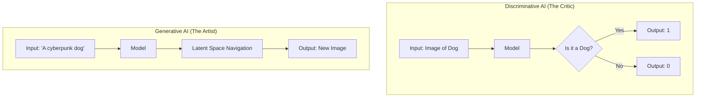
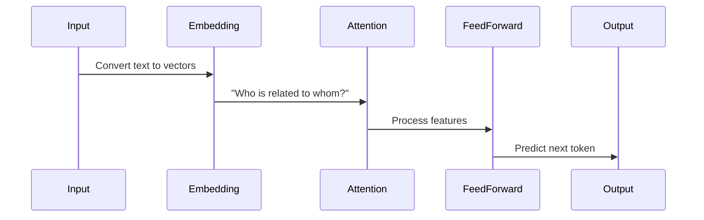

# Module 1: Introduction to Generative AI

## 1. The Generative AI Revolution

Welcome to the first module of your journey into Generative AI. You are standing at the precipice of a technological shift as significant as the internet or the smartphone. But to master it, we must move beyond the hype and understand the *mechanics*.

### What is Generative AI?

Generative AI refers to a class of artificial intelligence algorithms that can generate **new, original content**, including text, images, audio, and video.

To understand it, let's contrast it with what came before: **Discriminative AI**.

*   **Discriminative AI (Traditional)**: This is about *classification*. You show it a picture, and it says "Cat" or "Dog". You show it a transaction, and it says "Fraud" or "Legit". It draws a line in the sand to separate data.
*   **Generative AI (Modern)**: This is about *creation*. You show it a picture of a cat, and it learns the *concept* of a cat—the texture of fur, the shape of ears, the whiskers. Then, you ask it to "Draw a cat on the moon," and it creates a pixel-perfect image that has never existed before.

### Visualizing the Difference



---

## 2. The Engine: Transformer Architecture

The backbone of modern Generative AI (especially for text) is the **Transformer** architecture, introduced by Google researchers in the landmark 2017 paper, *"Attention Is All You Need"*.

Before Transformers, AI struggled with long sentences. It read word-by-word (like a human reading a scroll), often forgetting the beginning of the sentence by the time it reached the end.

### The "Cocktail Party" Analogy (Self-Attention)

Imagine you are at a loud cocktail party.
*   **RNNs (Old AI)**: You try to listen to *everyone* in the room sequentially. By the time you listen to the last person, you've forgotten what the first person said.
*   **Transformers (New AI)**: You have a superpower. You can instantly "attend" to specific keywords relevant to you. If someone across the room says "Fire!", your attention snaps to them, ignoring the noise.

**Self-Attention** allows the model to weigh the importance of different words in a sentence regardless of their distance. In the sentence *"The animal didn't cross the street because **it** was too tired"*, the model knows that "**it**" refers to the **animal**, not the **street**, because of the attention mechanism.

### Simplified Transformer Flow



---

## 3. Key Terminology for the Enterprise

To speak the language of GenAI experts, you need to master these terms:

*   **LLM (Large Language Model)**: A model trained on a massive dataset (petabytes of text). Examples: GPT-4, Claude 3, Llama 3.
*   **Prompt**: The input you provide. It's not just a query; it's a set of instructions, constraints, and context.
*   **Context Window**: The "short-term memory" of the model. If a model has a 128k token context window, it can "read" a 300-page book in one go. Exceeding this cuts off the beginning of your text.
*   **Hallucination**: When an LLM generates incorrect information confidently. This happens because the model isn't a database of facts; it's a probabilistic engine predicting the next word. It prioritizes *fluency* over *factuality*.
*   **Temperature**: A dial for creativity.
    *   `0.0`: Deterministic. Good for code and math.
    *   `1.0`: Creative. Good for poetry and brainstorming.
*   **Seed**: A parameter to ensure reproducibility. If you use the same seed and the same prompt, the model should generate the same output (mostly).

---

## 4. Hands-On: Your First LLM Call

Let's write some Python code. We will use the OpenAI library, which has become the standard interface for many LLMs (even open-source ones via tools like Ollama).

### Prerequisites
You will need an API key. If you don't have one, you can use a local model (covered in Module 11), but the code structure remains the same.

```bash
pip install openai
```

### The Code

```python
import os
from openai import OpenAI

# 1. Initialize the client
# In production, never hardcode API keys. Use environment variables.
client = OpenAI(api_key=os.environ.get("OPENAI_API_KEY"))

def generate_text(prompt, model="gpt-4o", temp=0.7):
    """
    Wraps the API call to generate text.
    """
    try:
        response = client.chat.completions.create(
            model=model,
            messages=[
                # System Prompt: Sets the behavior/persona
                {"role": "system", "content": "You are a helpful, concise technical assistant."},
                # User Prompt: The actual request
                {"role": "user", "content": prompt}
            ],
            temperature=temp,
            seed=42 # Ensures consistent results for testing
        )
        return response.choices[0].message.content
    except Exception as e:
        return f"Error: {e}"

# 2. Run the function
user_query = "Explain the concept of 'Recursion' to a 10-year-old."
result = generate_text(user_query)

print("-" * 20)
print(f"Query: {user_query}")
print("-" * 20)
print(result)
print("-" * 20)
```

### Why this structure?
Notice the `messages` list. Modern LLMs are "Chat Models". They expect a conversation history, not just a single string.
*   **System**: The "God Mode" instruction. It sets the rules.
*   **User**: The human input.
*   **Assistant**: The AI's previous replies (used for maintaining conversation history).

---

## 5. The Generative AI Stack

As an enterprise architect, you aren't just "calling an API". You are building a stack.

1.  **Infrastructure**: GPUs (NVIDIA H100s) or Cloud (AWS Bedrock, Azure, GCP).
2.  **Models**: Foundation Models (GPT-4, Llama 3) vs. Specialized Models (Med-PaLM).
3.  **Orchestration**: Frameworks to glue it all together (LangChain, LlamaIndex).
4.  **Vector Database**: Long-term memory (Pinecone, Weaviate).
5.  **Application**: The frontend (Streamlit, React).

## Next Steps

You now understand the *what* and the *how*. But how does the model actually understand the word "Apple"? It doesn't. It understands numbers.

In **Module 2**, we will demystify **Tokens and Embeddings**, the mathematical foundation of all NLP.
