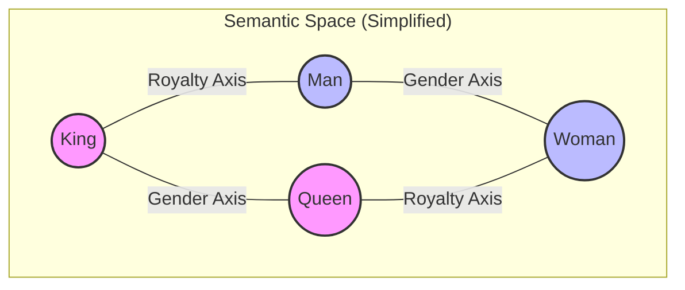

# Module 2: NLP Fundamentals - Tokens & Embeddings

To build effective GenAI applications, you must understand the raw materials: **Tokens** and **Embeddings**. If LLMs are the engine, these are the fuel.

## 1. The "Alien Language" Problem

Computers are fundamentally calculators. They understand math, not English. If you feed the string "Apple" to a neural network, it sees a stream of meaningless bytes (`01000001...`).

To bridge this gap, we need two steps:
1.  **Tokenization**: Breaking text into atomic units (Tokens).
2.  **Embedding**: Converting those tokens into meaningful numbers (Vectors).

---

## 2. Tokenization: The Art of Breaking Things

A "Token" is not always a word. It's a chunk of text.

### Why not just split by space?
If we split by space, "Apple" and "Apples" are two completely unrelated words. "Don't" becomes one word, hiding the "Do" and "Not".

### Modern Approach: Byte Pair Encoding (BPE)
LLMs use **Subword Tokenization**. They look for common patterns of characters.
*   Common words like "apple" are single tokens.
*   Complex words like "unfriendliness" might be split into `["un", "friend", "li", "ness"]`.

This allows the model to understand words it has never seen before by understanding their *parts*.

### Hands-On: Exploring Tokens

Let's use `tiktoken`, the tokenizer used by OpenAI's GPT models.

```python
# pip install tiktoken
import tiktoken

def analyze_tokens(text, model="gpt-4o"):
    # Load the specific encoding for the model
    encoding = tiktoken.encoding_for_model(model)
    
    # Encode: Text -> Integers
    token_ids = encoding.encode(text)
    
    print(f"Original Text: '{text}'")
    print(f"Token Count: {len(token_ids)}")
    print(f"Token IDs: {token_ids}")
    
    # Decode: Integers -> Text Chunks
    print("\n--- Visualizing Chunks ---")
    for t_id in token_ids:
        chunk = encoding.decode_single_token_bytes(t_id)
        print(f"ID {t_id:<6} -> {chunk}")

# Try a tricky sentence
analyze_tokens("GenerativeAI is supercalifragilisticexpialidocious!")
```

**Key Takeaway**:
*   1 Token $\approx$ 0.75 words (in English).
*   You pay by the token.
*   Context windows are measured in tokens.

---

## 3. Embeddings: The Geometry of Meaning

Once we have token IDs (like `4521`), we are still just dealing with arbitrary integers. `4521` isn't "closer" to `4522` in meaning.

We need **Embeddings**. An embedding is a list of floating-point numbers (a vector) that places the word in a multi-dimensional "Semantic Space".

### The "Grocery Store" Analogy
Imagine a grocery store.
*   **Apples** are in Aisle 1.
*   **Bananas** are in Aisle 1 (close to Apples).
*   **Motor oil** is in Aisle 10 (far from Apples).

An embedding is just the coordinates of the word in this store.
*   Apple: `[1.2, 0.5, ...]`
*   Banana: `[1.3, 0.6, ...]`
*   Motor Oil: `[9.8, 8.1, ...]`

### Visualizing Vector Space



The magic of embeddings is that **math works on meaning**.
$$ \text{King} - \text{Man} + \text{Woman} \approx \text{Queen} $$

---

## 4. Measuring Similarity (Cosine Similarity)

How do we calculate if two sentences are similar? We measure the angle between their vectors.

*   **Cosine Similarity = 1**: Vectors point in the exact same direction (Identical meaning).
*   **Cosine Similarity = 0**: Vectors are orthogonal (Unrelated).
*   **Cosine Similarity = -1**: Vectors are opposite (Opposite meaning).

### Hands-On: Semantic Search

We will use `sentence-transformers`, a popular open-source library, to build a mini search engine.

```python
# pip install sentence-transformers numpy
from sentence_transformers import SentenceTransformer
import numpy as np

# 1. Load a small, efficient model
model = SentenceTransformer('all-MiniLM-L6-v2')

# 2. Our "Database" of documents
documents = [
    "The cat sits on the mat.",
    "A man is playing the guitar.",
    "The dog is playing in the garden.",
    "Pizza is a popular Italian dish."
]

# 3. Encode the documents (Convert text to vectors)
doc_embeddings = model.encode(documents)

# 4. The User Query
query = "musical instrument"
query_embedding = model.encode([query])[0]

# 5. Find the closest match
def cosine_similarity(a, b):
    return np.dot(a, b) / (np.linalg.norm(a) * np.linalg.norm(b))

print(f"Query: '{query}'\n")

for i, doc in enumerate(documents):
    score = cosine_similarity(query_embedding, doc_embeddings[i])
    print(f"Score: {score:.4f} | Doc: {doc}")
```

### Why is this revolutionary?
Notice that the query "musical instrument" does **not** appear in the document "A man is playing the guitar".
A traditional keyword search (Ctrl+F) would fail.
**Semantic Search** succeeds because the *concept* of guitar is close to the *concept* of musical instrument in vector space.

## Next Steps

Now that we can convert text into numbers and find similar concepts, we have the building blocks for **RAG**. In Module 4, we will scale this up from 4 sentences to 4 million documents using a **Vector Database**.
