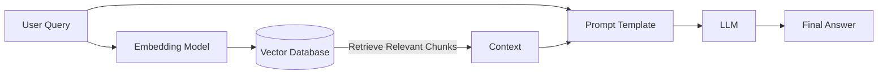

# Module 4: RAG, Vector Stores & Document Intelligence

**Retrieval Augmented Generation (RAG)** is the single most important pattern in Enterprise GenAI. It solves the two biggest problems of LLMs:
1.  **Knowledge Cutoff**: LLMs don't know about events that happened after they were trained.
2.  **Private Data**: LLMs don't know your company's internal emails, wikis, or databases.

## 1. The RAG Architecture

RAG bridges the gap between a static LLM and your dynamic private data. It's like giving the LLM an open-book exam.

### The Workflow
1.  **Retrieve**: Find the most relevant documents for the user's query.
2.  **Augment**: Paste those documents into the prompt context.
3.  **Generate**: Ask the LLM to answer the question *using only the provided context*.



---

## 2. Document Intelligence: Garbage In, Garbage Out

Before we can search documents, we must process them. This is often the hardest part of RAG.

### Step 1: Ingestion
Loading data from PDFs, HTML, Word Docs, Notion, Slack, etc.
*   *Challenge*: PDFs are visual formats, not semantic ones. Extracting tables and multi-column layouts is difficult.

### Step 2: Chunking Strategies
You cannot feed a 100-page PDF into an LLM (it's too expensive and confusing). You must split it into "Chunks".

| Strategy | Description | Pros | Cons |
| :--- | :--- | :--- | :--- |
| **Fixed Size** | Split every 500 characters. | Simple, fast. | Breaks sentences/ideas in half. |
| **Recursive** | Split by paragraph, then sentence, then word. | Preserves semantic structure. | Slightly slower. |
| **Semantic** | Split when the *topic* changes (using embeddings). | Best context preservation. | Expensive to compute. |

### Code Example: Recursive Chunking

```python
# pip install langchain langchain-text-splitters
from langchain_text_splitters import RecursiveCharacterTextSplitter

text = """
Generative AI is transforming industries. It allows for rapid content creation.
However, it requires careful implementation. Security is paramount.
"""

# Split by paragraphs (\n\n), then newlines (\n), then spaces
splitter = RecursiveCharacterTextSplitter(
    chunk_size=50,
    chunk_overlap=10, # Keep some overlap to maintain context across boundaries
    separators=["\n\n", "\n", " ", ""]
)

chunks = splitter.create_documents([text])

for i, chunk in enumerate(chunks):
    print(f"Chunk {i}: {chunk.page_content}")
```

---

## 3. Vector Stores (The "Brain" of RAG)

A Vector Database is a specialized database optimized for storing and searching high-dimensional vectors.

### Popular Options
*   **ChromaDB**: Open-source, runs locally (great for dev).
*   **Pinecone**: Fully managed, serverless (great for prod).
*   **Weaviate**: Hybrid search (Keyword + Vector).
*   **pgvector**: PostgreSQL extension (great if you already use Postgres).

### Code Example: Building a RAG Pipeline

We will use `ChromaDB` to build a local RAG system.

```python
# pip install langchain langchain-community langchain-openai chromadb
import os
from langchain_community.document_loaders import TextLoader
from langchain_text_splitters import RecursiveCharacterTextSplitter
from langchain_openai import OpenAIEmbeddings
from langchain_community.vectorstores import Chroma
from langchain_openai import ChatOpenAI
from langchain.chains import RetrievalQA

# 1. Load and Chunk Data
# Simulating a loaded document
raw_text = [
    "The company revenue grew by 20% in 2023 driven by AI adoption.",
    "Our new product 'GenX' launches in Q4 2024.",
    "The CEO is Jane Doe."
]
metadatas = [{"source": "financial_report"}, {"source": "roadmap"}, {"source": "org_chart"}]

# 2. Create Vector Store (Ingestion)
# This converts text -> vectors and stores them locally
embeddings = OpenAIEmbeddings()
db = Chroma.from_texts(raw_text, embeddings, metadatas=metadatas)

# 3. The Retrieval Step
# "k=1" means get the top 1 most similar chunk
retriever = db.as_retriever(search_kwargs={"k": 1})

# 4. The Generation Step
llm = ChatOpenAI(model="gpt-4o")
qa = RetrievalQA.from_chain_type(llm=llm, chain_type="stuff", retriever=retriever)

# 5. Run
query = "When is the new product launching?"
response = qa.invoke(query)

print(f"Query: {query}")
print(f"Answer: {response['result']}")
```

---

## 4. Advanced RAG Concepts

### Hybrid Search (The "Best of Both Worlds")
Vector search is great for concepts ("musical instrument" -> "guitar"), but bad for exact keywords ("Error Code 503").
**Hybrid Search** combines:
1.  **Vector Search** (Semantic)
2.  **Keyword Search** (BM25/TF-IDF)
...and re-ranks the results.

### The "Lost in the Middle" Phenomenon
LLMs pay more attention to the beginning and end of the context window. If the answer is buried in the middle of 10 retrieved documents, the model might miss it.
*   *Solution*: Re-rank your retrieved documents so the most relevant one is at the top or bottom.

### Parent Document Retrieval
Splitting a document into small chunks (e.g., 200 words) is good for search, but bad for context. The chunk might lack the "answer".
*   **Strategy**: Index small chunks for search, but retrieve the **Parent Document** (the full page or section) for the LLM.
*   **Benefit**: You get the precision of small chunks + the context of large chunks.

## 5. LlamaIndex: The Data Framework

While LangChain is great for "Chains" and "Agents", **LlamaIndex** (formerly GPT Index) is specialized for **Data Ingestion and Retrieval**.

If your problem is "I have 10,000 messy PDFs and I need to query them accurately," LlamaIndex is often the better tool.

### Key Features
*   **Data Loaders (LlamaHub)**: Connectors for Notion, Slack, Discord, SQL, etc.
*   **Node Parsers**: Advanced chunking that respects document structure (e.g., keeping a table together).
*   **Query Engines**: Pre-built logic for "Compare A vs B" or "Summarize all".

```python
# LlamaIndex Example
from llama_index.core import VectorStoreIndex, SimpleDirectoryReader

# 1. Load Data (One line to load a folder of PDFs)
documents = SimpleDirectoryReader("data").load_data()

# 2. Index Data
index = VectorStoreIndex.from_documents(documents)

# 3. Query
query_engine = index.as_query_engine()
response = query_engine.query("What is the summary of the Q3 report?")
print(response)
```

## Next Steps

RAG gives the model *knowledge*. But what if the model needs to *act* on that knowledge? (e.g., "Book a meeting with Jane Doe"). That's where **Agents** come in.
