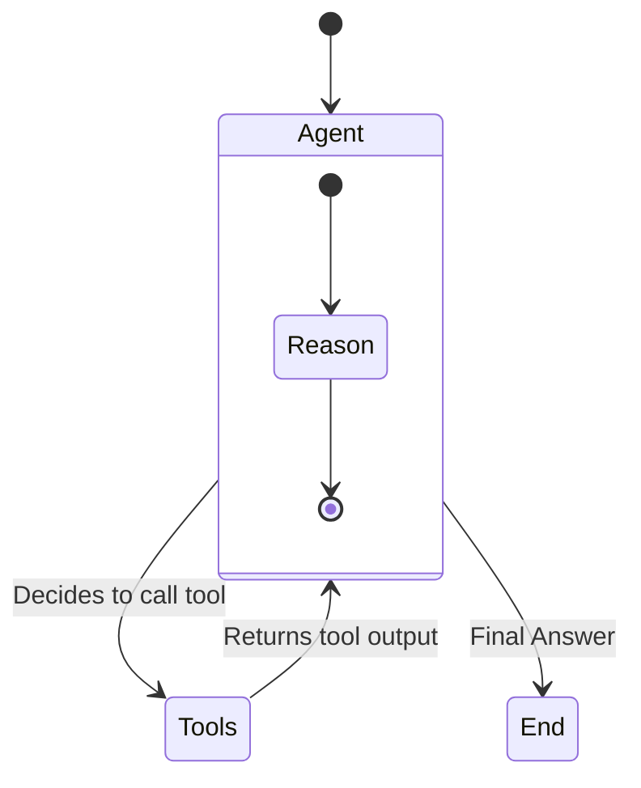

# Module 8: Agentic AI with LangGraph

We are now entering the frontier of Generative AI.
*   **RAG** allows LLMs to *know* things.
*   **Agents** allow LLMs to *do* things.

An agent uses an LLM as a reasoning engine to determine which actions to take and in what order. It is not a straight line; it is a loop.

## 1. The Evolution: Chains vs. Agents

### Chains (The Old Way)
A hardcoded sequence of steps.
> Step A -> Step B -> Step C.
*   *Example*: "Summarize this text, then translate it to French."
*   *Limitation*: If Step A fails, the whole chain fails. It cannot adapt.

### Agents (The New Way)
A system that decides the sequence of steps based on the input and current state.
> Loop: Think -> Act -> Observe -> Think...
*   *Example*: "Book a flight to Paris." (The agent might check prices, find it's too expensive, check different dates, and *then* book).

---

## 2. Introduction to LangGraph

**LangGraph** is a library for building stateful, multi-actor applications with LLMs. It is built on top of LangChain but focuses on **cycles** and **state persistence**, which are crucial for agents.

### Core Concepts

1.  **State**: A shared data structure (a Python Dictionary) that evolves as the graph executes. Every node receives the state and returns an update to the state.
2.  **Nodes**: Functions that perform work (e.g., call an LLM, run a tool).
3.  **Edges**: Logic that defines the control flow (e.g., "If tool output is X, go to Node B").
4.  **Conditional Edges**: The "Brain" of the graph. It looks at the state and decides where to go next.

### Visualizing an Agent Loop



---

## 3. Code Example: Building a Simple Agent

This example creates an agent that can use a search tool.

```python
# pip install langgraph langchain langchain-openai tavily-python
import os
from typing import TypedDict, Annotated, List, Union
from langchain_core.messages import BaseMessage, HumanMessage, AIMessage
from langchain_openai import ChatOpenAI
from langgraph.graph import StateGraph, END
from langchain_community.tools.tavily_search import TavilySearchResults

# 1. Define State
# This is the "Memory" of the agent. It holds the conversation history.
class AgentState(TypedDict):
    messages: List[BaseMessage]

# 2. Define Tools
tool = TavilySearchResults(max_results=2)
tools = [tool]
llm = ChatOpenAI(model="gpt-4o")
# We "bind" the tools to the LLM so it knows they exist
llm_with_tools = llm.bind_tools(tools)

# 3. Define Nodes
def agent_node(state: AgentState):
    """The 'Brain' node. It calls the LLM."""
    messages = state['messages']
    response = llm_with_tools.invoke(messages)
    # We return a dictionary that UPDATES the state
    return {"messages": [response]}

def tool_node(state: AgentState):
    """The 'Action' node. It executes the tool."""
    messages = state['messages']
    last_message = messages[-1]
    
    # If the LLM wants to call a tool
    if last_message.tool_calls:
        tool_call = last_message.tool_calls[0]
        if tool_call['name'] == 'tavily_search_results_json':
            print(f"--- Executing Tool: {tool_call['name']} ---")
            result = tool.invoke(tool_call['args'])
            return {"messages": [AIMessage(content=str(result))]}
    return {"messages": []}

# 4. Define Logic (Edges)
def should_continue(state: AgentState):
    """The Router. Decides if we stop or loop back."""
    last_message = state['messages'][-1]
    if last_message.tool_calls:
        return "tools"
    return END

# 5. Build Graph
workflow = StateGraph(AgentState)

workflow.add_node("agent", agent_node)
workflow.add_node("tools", tool_node)

workflow.set_entry_point("agent")
workflow.add_conditional_edges("agent", should_continue, {"tools": "tools", END: END})
workflow.add_edge("tools", "agent") # Loop back to agent after tool use

app = workflow.compile()

# 6. Run
inputs = {"messages": [HumanMessage(content="What is the current weather in San Francisco?")]}
for output in app.stream(inputs):
    for key, value in output.items():
        print(f"Node '{key}':")
        print(value)
        print("----")
```

---

## 4. Multi-Agent Systems (The Supervisor Pattern)

For complex tasks, one agent isn't enough. You need a team.
*   **Supervisor**: The "Manager". It breaks down the task and delegates to workers.
*   **Worker 1 (Researcher)**: Has access to Google Search.
*   **Worker 2 (Coder)**: Has access to a Python REPL.

The Supervisor LLM outputs a structured decision: `{"next_worker": "Researcher"}`.
LangGraph routes the state to the "Researcher" node. The Researcher does work and returns the state to the Supervisor.

This mimics a real-world org chart.

---

## 5. Safety in Agentic Workflows: Human-in-the-Loop

When agents have access to tools that can change state (e.g., `send_email`, `delete_file`, `transfer_money`), you cannot rely solely on the LLM. You need **Human-in-the-Loop (HITL)**.

LangGraph supports this natively via **interrupts**.

### Code Example: Human Approval Node

```python
# Define a graph that stops before the 'action' node
workflow = StateGraph(AgentState)
# ... (define nodes) ...

# Compile with an interrupt
app = workflow.compile(interrupt_before=["action_node"])

# Run until the interrupt
thread = {"configurable": {"thread_id": "1"}}
for event in app.stream(inputs, thread):
    pass

# Inspect state
current_state = app.get_state(thread)
print(f"Agent wants to execute: {current_state.next}")

# User approves (or modifies state)
# app.update_state(thread, {"approved": True})

# Resume execution
for event in app.stream(None, thread):
    print(event)
```

### Best Practices for Agent Safety
1.  **Read-Only Tools**: Give agents "read" access by default. "Write" access should require approval.
2.  **Timeouts**: Agents can get into infinite loops. Always set a maximum step count (recursion limit).
3.  **Scoped Permissions**: The API key used by the agent should have the minimum necessary privileges (Principle of Least Privilege).

## Next Steps

To make agents truly powerful, they need standard interfaces to connect to the outside world. Enter **MCP**.
